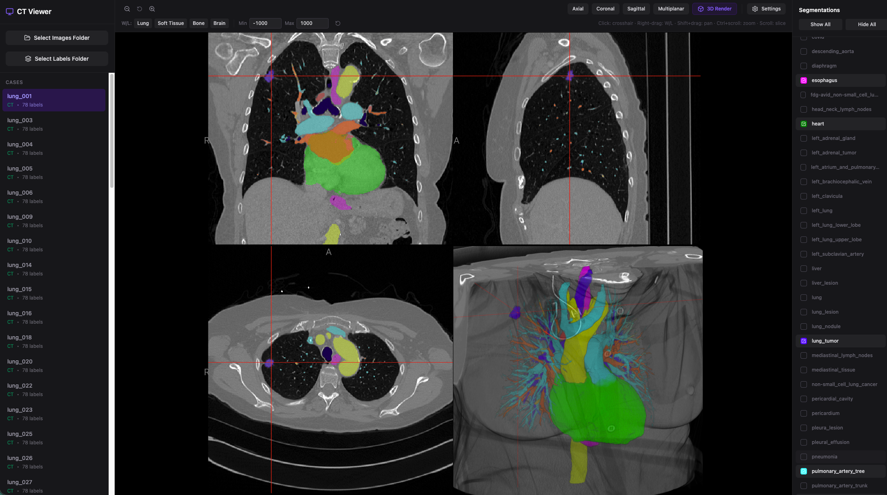

# Web CT & Segmentation Viewer

A fully offline, web-based CT and multi-segmentation viewer built with React, Tailwind CSS, and [Niivue](https://github.com/niivue/niivue).



## Features

- **Fully Offline**: All processing and rendering happens locally in your browser. No data is ever uploaded to a server, ensuring complete data privacy.
- **Local Folder Loading**: Select local directories containing your NIfTI files directly from the browser.
- **Multi-Segmentation Support**: Automatically pairs CT images with their corresponding segmentation masks based on filename conventions.
- **View Modes**: Axial, Coronal, Sagittal, Multiplanar, and full 3D Render views.
- **Window/Level Presets**: Quick presets for Lung, Soft Tissue, Bone, and Brain, plus manual min/max inputs and auto-range. Right-click and drag for real-time adjustment.
- **Per-Label Controls**: Individual opacity sliders, color pickers, and solo/isolate mode for each segmentation label.
- **Label Merging**: Memory-efficient mode that merges non-overlapping labels into indexed layers, with an option to load labels individually on demand.
- **3D Clipping Planes**: Adjustable depth, azimuth, and elevation with quick presets (Sagittal, Coronal, Axial). Option to hide the CT base volume in 3D.
- **Volume Metadata**: View dimensions, voxel size, data type, and intensity range for loaded volumes.
- **Screenshot Export**: Save the current view as a PNG image.
- **Collapsible Sidebars**: Maximize viewing space by collapsing the case list or label panel.
- **Label Search & Sort**: Filter labels by name and sort alphabetically or by load order.
- **Zoom**: Ctrl+scroll to zoom in 2D views, plus toolbar zoom buttons.
- **Settings**: Radiological/neurological convention, background color, render mode (matte, shiny, MIP), crosshair toggle.

## File Naming Convention

To ensure the viewer correctly pairs CT images with their segmentation masks, your files must follow this naming convention:

### Images Folder
Contains the raw CT scans.
Format: `{CASE_ID}.nii.gz` or `{CASE_ID}.nii`
Example:
- `lung_001.nii.gz`
- `lung_002.nii.gz`

### Labels Folder
Contains the segmentation masks.
Format: `{CASE_ID}_{LABEL_NAME}.nii.gz` or `{CASE_ID}_{LABEL_NAME}.nii`
Example:
- `lung_001_adrenal_glands.nii.gz`
- `lung_001_airways.nii.gz`
- `lung_002_aorta.nii.gz`

## How to Run Locally

Since this is a client-side React application, you can run it locally using Vite.

### Prerequisites
- Node.js (v18 or higher recommended)
- npm or yarn

### Installation

1. Clone the repository or download the source code.
2. Install the dependencies:
   ```bash
   npm install
   ```
3. Start the development server:
   ```bash
   npm run dev
   ```
4. Open your browser and navigate to `http://localhost:3000` (or the port specified in your terminal).

### Building for Production

To build a static version of the app that can be hosted on any static file server:

```bash
npm run build
```

The compiled files will be located in the `dist` directory.

## Usage Instructions

1. **Select Images Folder**: Click the "Select Images Folder" button in the left sidebar and choose the directory containing your `{CASE_ID}.nii.gz` files.
2. **Select Labels Folder**: Click the "Select Labels Folder" button and choose the directory containing your `{CASE_ID}_{LABEL_NAME}.nii.gz` files.
3. **View a Case**: Once the folders are scanned, a list of cases will appear in the left sidebar. Click on a case to load it into the viewer.
4. **Adjust View**: Use the toolbar at the top to switch between slice types (Axial, Coronal, Sagittal, Multiplanar, 3D Render) or apply Window/Level presets.
5. **Manage Labels**: Toggle labels on/off with checkboxes, adjust individual opacity and color, or use solo mode to isolate a single label.
6. **Manual Window/Level**: Right-click and drag on the image to adjust, or enter min/max values directly.

## Privacy & Security

This application utilizes the HTML5 File API to read files directly from your local file system into the browser's memory. **No data is transmitted over the internet.** It is completely safe to use with sensitive medical data.

## Technologies Used

- **React 19**: UI Framework
- **Niivue**: WebGL 2.0 medical image viewer
- **Tailwind CSS v4**: Utility-first CSS framework for styling
- **TypeScript**: Type-safe development
- **Lucide React**: Icon library
- **Vite**: Frontend tooling and bundler
